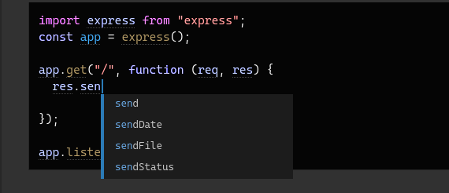

# Definition :

- In TypeScript, "Types for Tooling" refers to using the type system not just to catch code errors, but to power rich editor features like code autocompletion, instant documentation, and safe refactoring

## Example

### NB:

- TypeScript takes tooling seriously, and that goes beyond completions and errors as you type. An editor that supports TypeScript can deliver “quick fixes” to automatically fix errors, refactorings to easily re-organize code, and useful navigation features for jumping to definitions of a variable, or finding all references to a given variable. All of this is built on top of the type-checker and is fully cross-platform,
